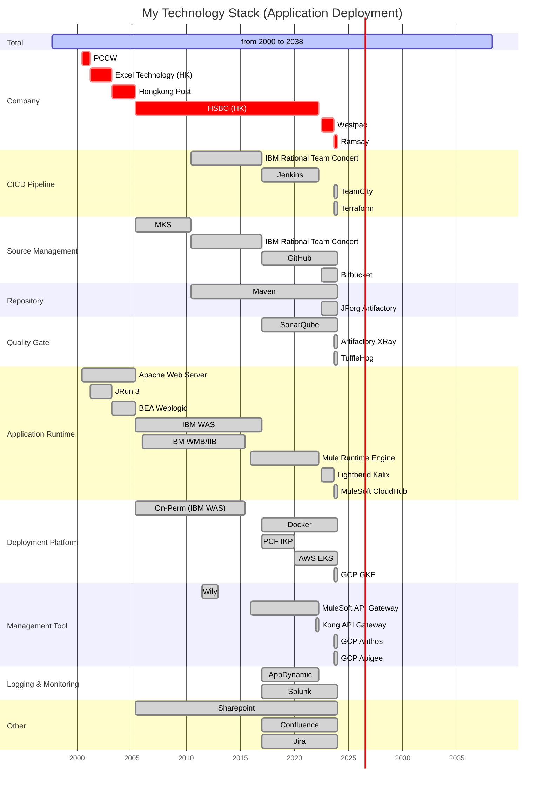

# résumé

@startmermaid
gantt
    dateFormat YYYY-MM-DD
    axisFormat %Y
    title My Career
    section Total
        from 1997 to 2038                  :active  ,            1997-09-01, 2038-04-05
    section HKEA
        Temporary Examinations Assistant   :crit    ,            1998-07-06, 1998-07-31
    section PCCW (HK)
        Internet Programmer                :crit    ,            2000-05-29, 2001-03-06
    section Excel Technology (HK)
        Analyst Programmer                 :crit    ,            2001-03-07, 2003-03-01
    section Hongkong Post
        Assistant Computer Officer         :crit    ,            2003-03-03, 2005-05-08
    section HSBC (HK)
        Senior Associate, HSBC (HK)        :crit    ,            2005-05-09, 2022-04-06
        EAI Infrastructure                 :done    , crit     , 2005-05-09, 2010-06-30
        Global Architecture and Foundation :done    , crit     , 2010-07-01, 2015-06-30
        Digital Services                   :done    , crit     , 2015-07-01, 2022-04-06
        IT Officer                         :done    ,            2005-05-09, 2007-11-30
        Senior ITO                         :done    ,            2007-12-01, 2010-06-30
        Senior Development Officer         :done    ,            2010-07-01, 2017-02-28
        Development Specialist             :done    ,            2017-03-01, 2018-12-31
        Senior Development Specialist      :done    ,            2019-01-01, 2020-12-31
        Senior Associate                   :done    ,            2021-01-01, 2022-04-06
    section TCS (ANZ)
        Consultancy, TCS                   :crit    ,            2022-06-15, 2023-10-31
        Senior Engineer, Westpac           :done    , crit     , 2022-07-04, 2023-08-25
        API Developer, Ramsay              :active  ,            2023-08-28, 2023-10-31
@endmermaid

```mermaid
gantt
    dateFormat YYYY-MM-DD
    axisFormat %Y
    title My Technology Stack (Application Development)
    section Total
        from 2000 to 2038                  :active  ,            1997-09-01, 2038-04-05
    section Company
        PCCW                               :crit    ,            2000-05-29, 2001-03-06
        Excel Technology (HK)              :crit    ,            2001-03-07, 2003-03-01
        Hongkong Post                      :crit    ,            2003-03-03, 2005-05-08
        HSBC (HK)                          :crit    ,            2005-05-09, 2022-04-06
        Westpac                            :crit    ,            2022-07-04, 2023-08-25
        Ramsay                             :crit    ,            2023-08-28, 2023-12-31
    section Coding IDE
        Borland JBuilder                   :done    ,            2001-03-07, 2003-03-01
        Oracle J-Developer                 :done    ,            2003-03-03, 2005-05-08
        IBM Rational Application Developer :done    ,            2005-05-09, 2015-06-30
        Eclipse                            :done    ,            2010-07-01, 2023-12-31
        Anypoint Studio                    :done    ,            2015-07-01, 2018-12-31
        IntelliJ IDEA                      :done    ,            2019-01-01, 2022-04-06
        Visual Studio Code                 :done    ,            2019-01-01, 2023-12-31
    section Coding Language
        ASP                                :done    ,            2000-05-29, 2001-01-31
        HTML                               :done    ,            2000-05-29, 2005-05-08
        JavaScript                         :done    ,            2000-05-29, 2005-05-08
        PERL/CGI                           :done    ,            2000-05-29, 2001-01-31
        PL/SQL                             :done    ,            2000-05-29, 2005-05-08
        Shell Scripting                    :done    ,            2000-05-29, 2010-06-30
        C                                  :done    ,            2001-02-01, 2001-03-06
        CSS                                :done    ,            2001-03-07, 2005-05-08
        Java                               :done    ,            2001-03-07, 2023-12-31
        Visual Basic                       :done    ,            2003-03-03, 2005-05-08
        Visual C++                         :done    ,            2003-03-03, 2005-05-08
        COBOL                              :done    ,            2005-05-09, 2006-06-30
        JCL                                :done    ,            2005-05-09, 2006-06-30
        DataWeave                          :done    ,            2016-01-01, 2019-12-31
        Mule Expression Language           :done    ,            2016-01-01, 2019-12-31
        JavaScript                         :done    ,            2019-01-01, 2023-12-31
        Python 3                           :done    ,            2020-01-01, 2023-12-31
        Groovy                             :done    ,            2021-01-01, 2022-04-06
        SQL                                :done    ,            2021-01-01, 2022-04-06
        Lua                                :done    ,            2022-01-01, 2022-04-06
    section Coding Framework
        J2EE                               :done    ,            2001-03-07, 2015-06-30
        Java Servlet                       :done    ,            2001-03-07, 2005-05-08
        JSP                                :done    ,            2001-03-07, 2005-05-08
        HSBC ES Framework                  :done    ,            2005-05-09, 2010-06-30
        Spring Core                        :done    ,            2010-07-01, 2015-06-30
        Spring Batch                       :done    ,            2011-01-01, 2015-06-30
        Spring Data                        :done    ,            2011-01-01, 2015-06-30
        Spring JMS                         :done    ,            2011-01-01, 2015-06-30
        Spring MVC                         :done    ,            2011-01-01, 2015-06-30
        Spring Integration                 :done    ,            2013-01-01, 2013-12-31
        Spring Boot                        :done    ,            2015-07-01, 2023-12-31
        Spring Web                         :done    ,            2015-07-01, 2022-04-06
        Mule Configuration                 :done    ,            2016-01-01, 2019-12-31
        Mule Connector Kit                 :done    ,            2016-01-01, 2019-12-31
        Bootstrap                          :done    ,            2019-01-01, 2023-12-31
        Express.js                         :done    ,            2019-01-01, 2023-12-31
        Node.js                            :done    ,            2019-01-01, 2023-12-31
        Spring Reactive                    :done    ,            2019-01-01, 2022-04-06
        Spring JPA                         :done    ,            2021-01-01, 2022-04-06
        JavaPoet                           :done    ,            2022-07-04, 2023-08-25
        Maven MOJO Plugin                  :done    ,            2022-07-04, 2023-08-25
    section UI Development
        Macromedia Flash                   :done    ,            2000-05-29, 2001-01-31
        Java Swing                         :done    ,            2003-03-03, 2005-05-08
        Oracle Form & Report 6i            :done    ,            2003-03-03, 2005-05-08
    section Message Protocol
        HTTPS                              :done    ,            2000-05-29, 2023-12-31
        LDAP                               :done    ,            2001-02-01, 2001-03-06
        JDBC                               :done    ,            2001-03-07, 2022-04-06
        IBM MQ                             :done    ,            2005-05-09, 2022-04-06
        TCP stream                         :done    ,            2007-01-01, 2010-06-30
        Apache Kafka                       :done    ,            2022-11-01, 2023-03-31
    section Message Format
        SOAP/XML                           :done    ,            2003-03-03, 2023-12-31
        Fixed-length                       :done    ,            2005-05-09, 2022-04-06
        SWIFT                              :done    ,            2007-01-01, 2007-11-01
        REST/JSON                          :done    ,            2015-07-01, 2023-12-31
        HL7 & FHIR                         :done    ,            2023-08-28, 2023-12-31
    section Data Store
        MS SQL Server                      :done    ,            2000-05-29, 2003-03-01
        Oracle Database                    :done    ,            2001-03-07, 2011-06-30
        IBM DB2                            :done    ,            2005-05-09, 2006-12-31
        Hazelcast                          :done    ,            2020-01-01, 2020-12-31
        PostgreSQL                         :done    ,            2021-01-01, 2022-04-06
    section Testing
        Apache Jmeter                      :done    ,            2011-07-01, 2022-04-06
        Apache Junit                       :done    ,            2011-07-01, 2023-12-31
        JMX                                :done    ,            2011-07-01, 2012-12-31
        YourKit                            :done    ,            2011-07-01, 2012-12-31
        POSTMAN                            :done    ,            2017-01-01, 2023-12-31
        Mockito                            :done    ,            2021-01-01, 2023-12-31
        Wiremock                           :done    ,            2021-01-01, 2023-12-31
```

